# What is Virtualization?

Virtualization is the process of creating a virtual version of physical hardware, such as servers, storage devices, or networks. It also allows running multiple virtual machines on a single physical machine.

---

# Types of Virtualization

* **Server Virtualization:** Abstracts physical server hardware (CPU, RAM, storage) into multiple independent virtual machines (VMs), allowing multiple operating systems to run on a single physical host.
* **OS-Level Virtualization (Containerization):** Shares the host OS kernel to run isolated user-space instances (e.g., Docker, LXC). It is much lighter and faster than traditional full-hardware virtualization.
* **Network Virtualization:** Decouples network management from physical hardware. Creates virtual switches, routers, firewalls, and VPNs (e.g., VMware NSX, AWS VPC).
* **Storage Virtualization:** Pools physical storage from multiple network storage devices into what appears to be a single storage unit (e.g., SAN/NAS virtualization, Software-Defined Storage like Ceph).
* **Desktop Virtualization (VDI):** Hosts desktop environments on a centralized server, allowing users to access their virtual desktops remotely (e.g., Citrix Virtual Desktops, VMware Horizon).

---

# Types of Hypervisors

```mermaid
graph TD
    %% Type 1 Hypervisor Architecture
    subgraph Type1 [Type 1: Bare-Metal Hypervisor]
        T1_HW[Physical Hardware<br>CPU, RAM, Storage, Network] --- T1_Hyp[Hypervisor / VMM<br>e.g., VMware ESXi, KVM, Hyper-V]
        T1_Hyp --> T1_VM1[Guest OS / VM 1]
        T1_Hyp --> T1_VM2[Guest OS / VM 2]
        T1_VM1 --> T1_App1[Applications]
        T1_VM2 --> T1_App2[Applications]
    end

    %% Type 2 Hypervisor Architecture
    subgraph Type2 [Type 2: Hosted Hypervisor]
        T2_HW[Physical Hardware<br>CPU, RAM, Storage, Network] --- T2_OS[Host OS<br>Windows, Linux, macOS]
        T2_OS --- T2_Hyp[Hypervisor / VMM<br>e.g., VirtualBox, VMware Workstation]
        T2_Hyp --> T2_VM1[Guest OS / VM 1]
        T2_Hyp --> T2_VM2[Guest OS / VM 2]
        T2_VM1 --> T2_App1[Applications]
        T2_VM2 --> T2_App2[Applications]
    end

    %% Styling
    style T1_HW fill:#2c3e50,stroke:#333,stroke-width:2px,color:#fff
    style T1_Hyp fill:#2980b9,stroke:#333,stroke-width:2px,color:#fff
    style T1_VM1 fill:#27ae60,stroke:#333,stroke-width:1px,color:#fff
    style T1_VM2 fill:#27ae60,stroke:#333,stroke-width:1px,color:#fff
    style T2_HW fill:#2c3e50,stroke:#333,stroke-width:2px,color:#fff
    style T2_OS fill:#8e44ad,stroke:#333,stroke-width:2px,color:#fff
    style T2_Hyp fill:#2980b9,stroke:#333,stroke-width:2px,color:#fff
    style T2_VM1 fill:#27ae60,stroke:#333,stroke-width:1px,color:#fff
    style T2_VM2 fill:#27ae60,stroke:#333,stroke-width:1px,color:#fff

```

---

# Types of Cloud Models

## 1. Cloud Service Models

* **IaaS (Infrastructure as a Service):**
Provides basic computing resources such as virtual machines, storage, networks, and firewalls. You manage the OS, runtime, data, and applications.
  **Examples:** AWS EC2, Google Compute Engine (GCE), Microsoft Azure VMs.

* **PaaS (Platform as a Service):**
Provides a runtime environment and framework for developers to build, deploy, and manage applications without worrying about underlying servers, OS, or infrastructure maintenance.
  **Examples:** AWS Elastic Beanstalk, Google App Engine, Heroku.

* **SaaS (Software as a Service):**
Delivers complete, fully managed software applications over the internet accessible via web browsers or APIs.
  **Examples:** Google Workspace, Microsoft 365, Salesforce, Dropbox.

---

## 2. Cloud Deployment Models

* **Public Cloud:** Owned and operated by third-party cloud service providers, sharing resources across multiple clients over the public internet (e.g., AWS, GCP, Azure).
* **Private Cloud:** Cloud infrastructure dedicated exclusively to a single organization, hosted either on-premises or by a third party.
* **Hybrid Cloud:** Combines public and private clouds, allowing data and applications to be shared between them for greater flexibility and security.
* **Multi-Cloud:** Uses services from multiple public cloud providers (e.g., AWS + GCP) to avoid vendor lock-in and optimize performance.
