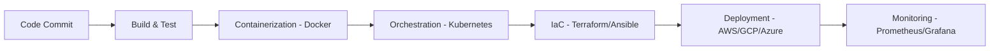
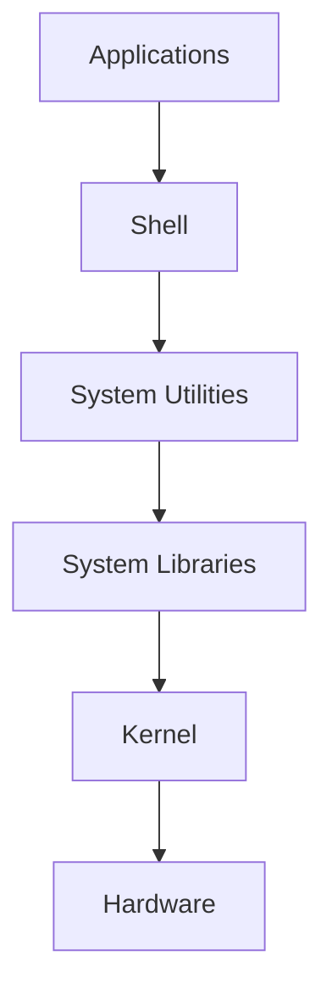
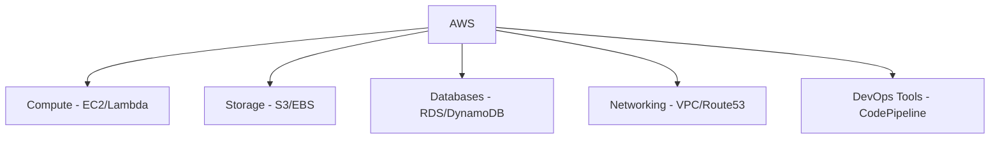
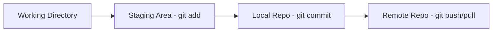
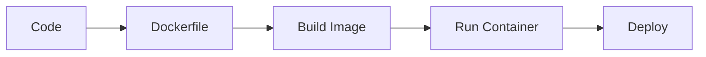
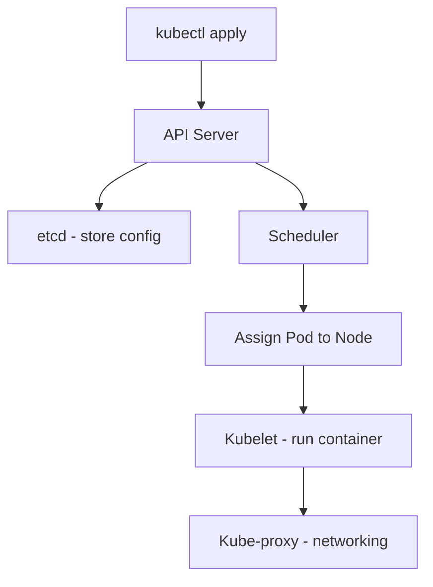

# 📘 DevOps & Cloud Engineering Notes

## 1. DevOps Overview
- **Definition**: DevOps = Development + Operations → culture + practices for faster delivery & reliability.
- **Principles**: CI/CD, Automation, Collaboration, Monitoring.

### 🔄 DevOps Workflow

---

## 2. Linux
- **Definition**: Open‑source OS based on Unix.
- **Architecture**:

---

## 3. AWS (Amazon Web Services)
- **Definition**: Largest cloud platform (200+ services).
- **Core Services**: EC2, S3, RDS, VPC, CodePipeline, CloudFormation.

### ☁️ AWS Service Categories

---

## 4. Git
- **Definition**: Distributed version control system.
- **Workflow**:

---

## 5. GitHub vs GitLab
| Aspect       | GitHub                          | GitLab                          |
|--------------|---------------------------------|---------------------------------|
| Focus        | Collaboration, open‑source      | End‑to‑end DevOps lifecycle     |
| CI/CD        | GitHub Actions                  | Native CI/CD built‑in           |
| Community    | Largest developer base          | Smaller, enterprise‑focused     |
| Hosting      | Cloud‑based                     | Cloud + self‑hosting option     |

---

## 6. Docker
- **Definition**: Containerization platform.
- **Workflow**:

---

## 7. Kubernetes (K8s)
- **Definition**: Container orchestration platform.
- **Workflow**:

---

## 8. Interview Quick Prep
- **DevOps**: “Culture + practices for faster delivery, reliability, and collaboration.”
- **Linux vs Windows**: “Linux is open‑source, CLI‑driven, stable; Windows is proprietary, GUI‑driven.”
- **AWS EC2 vs Lambda**: “EC2 = virtual servers; Lambda = serverless functions.”
- **Git vs SVN**: “Git stores snapshots, distributed; SVN stores deltas, centralized.”
- **GitHub vs GitLab**: “GitHub = collaboration; GitLab = full DevOps lifecycle.”
- **Docker vs VM**: “VMs emulate hardware; Docker containers share OS kernel → lightweight.”
- **Kubernetes vs Docker**: “Docker = containerization; Kubernetes = orchestration of containers.”
