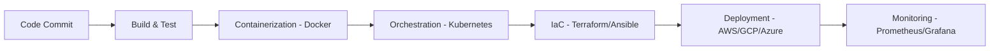
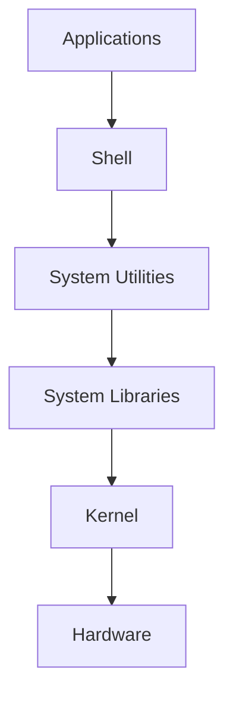
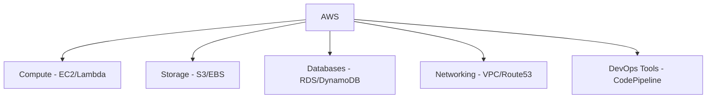
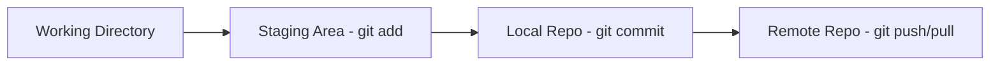
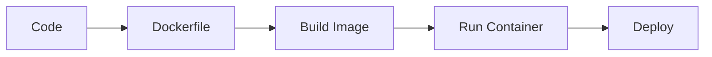
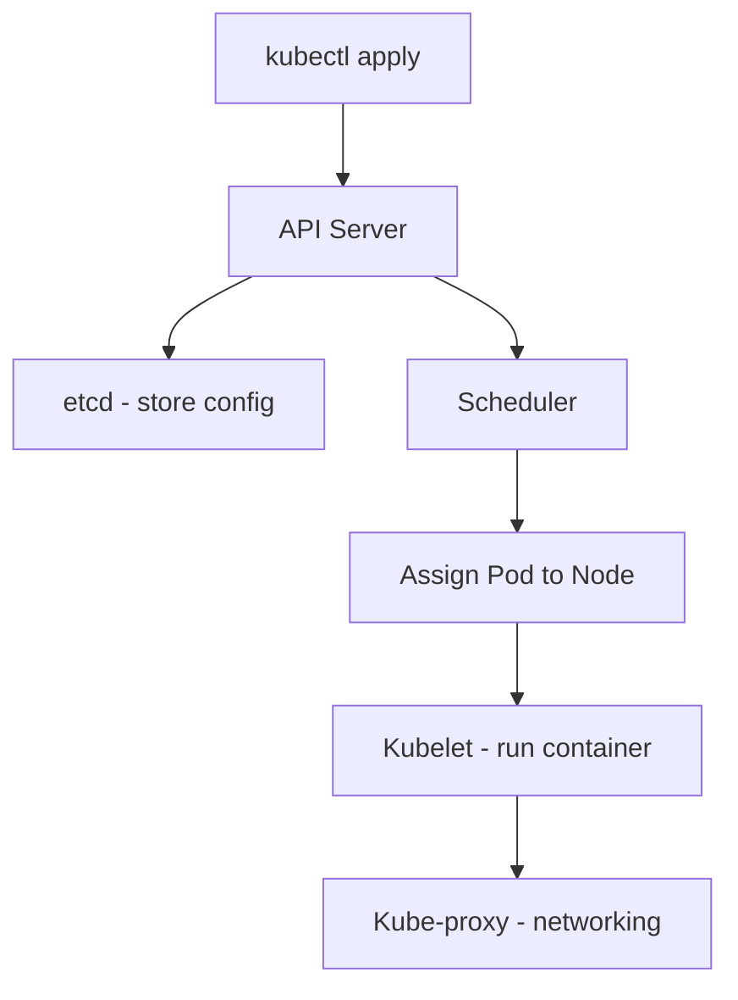

# 📘 DevOps & Cloud Engineering Notes (Concise + Architecture)

## 1. DevOps
**Definition**: DevOps is a culture and practice that integrates software development and IT operations. It emphasizes automation, CI/CD, collaboration, and monitoring to deliver applications faster and more reliably.

### 🔄 DevOps Workflow


---

## 2. Linux
**Definition**: Linux is an open‑source operating system based on Unix. It provides stability, security, and flexibility, making it the backbone of servers, cloud platforms, and DevOps environments.

### 🖥️ Linux Architecture


---

## 3. AWS (Amazon Web Services)
**Definition**: AWS is Amazon’s cloud computing platform offering 200+ services like compute, storage, networking, and DevOps tools. It enables scalable, cost‑efficient, and globally available infrastructure.

### ☁️ AWS Service Categories


---

## 4. Git
**Definition**: Git is a distributed version control system that tracks code changes as snapshots. It allows branching, merging, and collaboration across teams with full project history stored locally.

### 🔄 Git Workflow


---

## 5. GitHub vs GitLab
**Definition**: GitHub is a cloud platform for hosting Git repositories with strong community collaboration. GitLab is a DevOps lifecycle platform that combines Git hosting with built‑in CI/CD and deployment tools.

---

## 6. Docker
**Definition**: Docker is a containerization platform that packages applications and dependencies into portable containers. It ensures consistency across environments and supports microservices architecture.

### 🐳 Docker Workflow


---

## 7. Kubernetes (K8s)
**Definition**: Kubernetes (K8s) is an open‑source container orchestration system. It automates deployment, scaling, and management of containerized applications across clusters of machines.

### ☸️ Kubernetes Architecture


---

## 8. Interview Quick Prep
- DevOps → “Culture + practices for faster delivery and reliability.”
- Linux → “Open‑source OS, stable and secure, widely used in servers.”
- AWS → “Cloud platform with 200+ services for scalable infrastructure.”
- Git → “Distributed version control system storing snapshots.”
- GitHub vs GitLab → “GitHub = collaboration; GitLab = full DevOps lifecycle.”
- Docker → “Lightweight containers for consistent app deployment.”
- Kubernetes → “Orchestrates and manages containers across clusters.”
```
